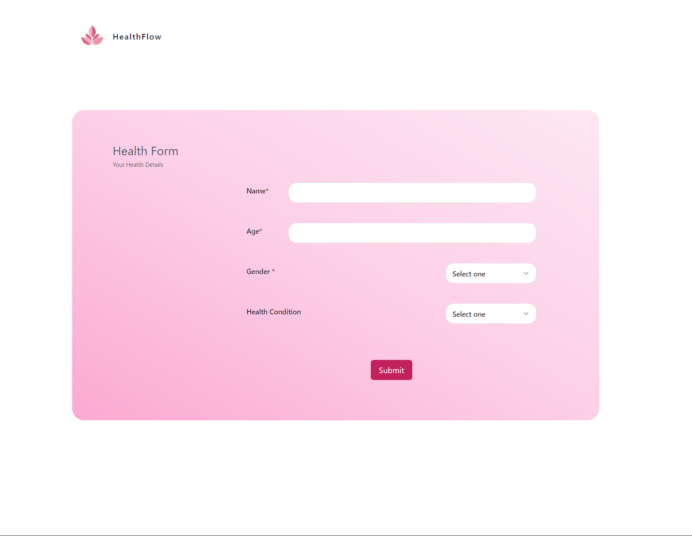
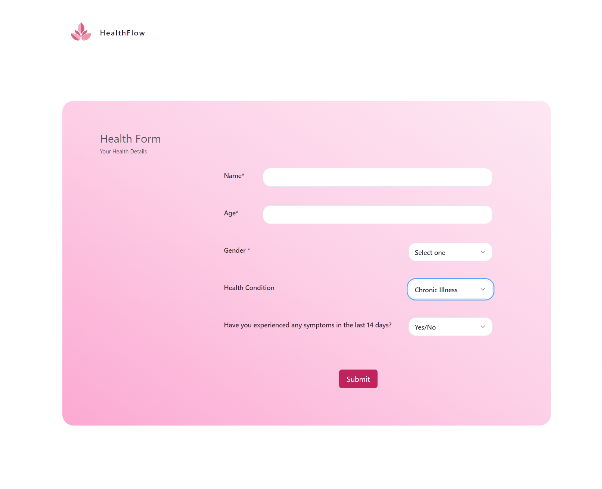
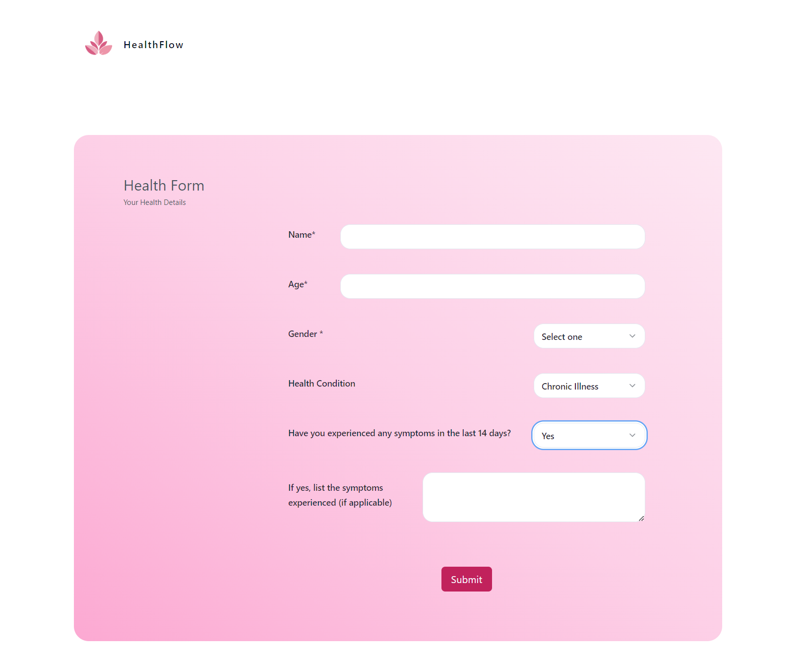
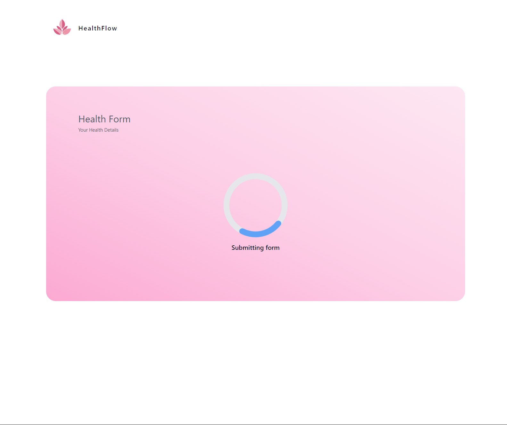
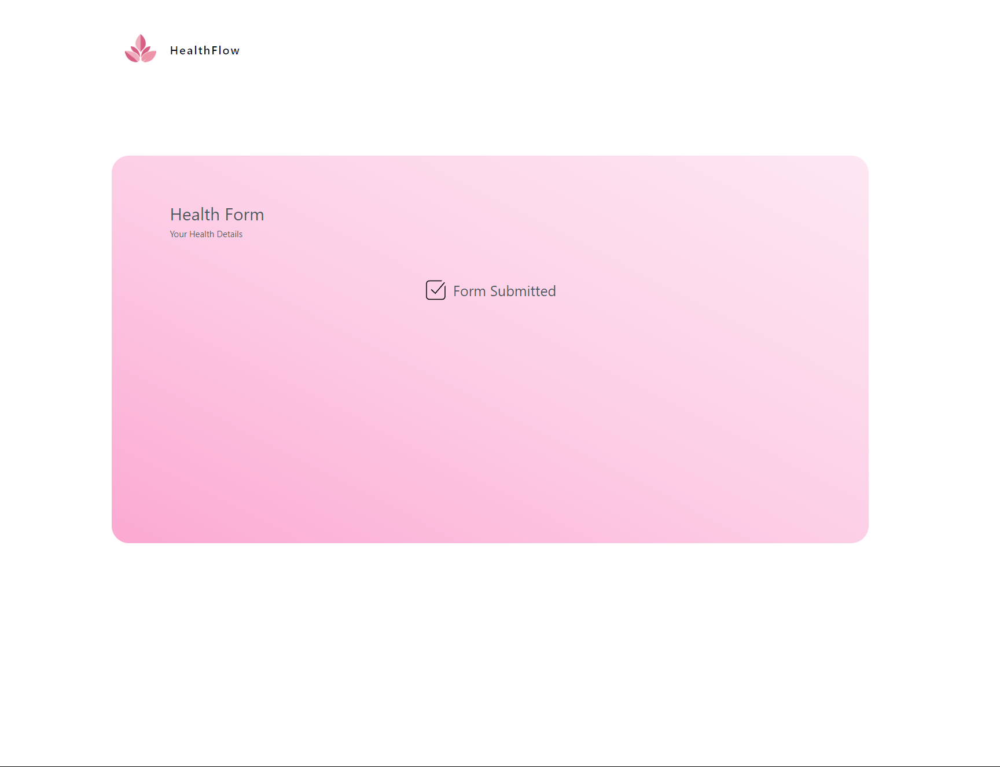

### Health Care Application

#### Project Overview

This project involves building a health care application featuring a form questionnaire with branching logic. The application is developed using Typescript for both frontend and backend. React is used for the frontend, while NodeJS serves as the backend. Data is stored and retrieved from a MySQL database. Unit and integration tests are implemented to ensure the functionality and reliability of the application.





#### Features

- Form Questionnaire with Branching Logic
- Loading and success states
- Unit & Integration Testing
- Database: MySQL

- Frontend: React with Typescript
- Backend: NodeJS with Typescript





#### Installation

#### Easy set up with docker

1. Ensure you have Docker running, [install here](https://www.docker.com/get-started/)
2. Build images with `docker-compose build` at the root of the project
3. Run `docker-compose up`

Frontend should run on port 3000, and backend on port 8080.

##### Manual / Dev set up

Clone the repository and install frontend and backend dependencies:

```
cd frontend
npm install
```

```
cd backend
npm install
```

- Run the database in docker with `docker-compose up` at the root of the project

- Run migrations in the backend with `npx prisma db push`

- Start both frontend and backend services with: `npm run dev` in the frontend folder and `npm start` in the backend.

- The application should now be running on ports 8080 (backend) and 3000 (frontend).

#### Api routes:

##### /questionnaires (POST):

###### Expected request body:

```
{
name: string;
age: number;
gender: string;
healthCondition: string;
symptomsExperienced?: boolean;
symptoms?: string;
}
```

###### Expected response code: 204

##### /questionnaires (GET):

###### Expected response structure:

```
{
name: string,
age: int,
gender: 'Male' | 'Female' | 'Not_specified',
healthCondition: 'Healthy' | 'Minor_illness' | 'Chronic_illness',
symptomsExperienced: boolean,
symptoms: string,
createdAt: DateTime,
}
```

Database Schema:

```


model Questionnaire {
  id                  Int             @id @default(autoincrement())
  name                String
  age                 Int
  gender              Gender
  healthCondition     HealthCondition
  symptomsExperienced Boolean?
  symptoms            String?
  createdAt           DateTime        @default(now())
}


enum Gender {
  Male
  Female
  Not_specified
}

enum HealthCondition {
  Healthy
  Minor_illness
  Chronic_illness
}

```

Technologies used:
React, Tailwind, TypeScript, MySQL, Prisma, Vite, Express, Jest, Docker, react-hook-form

##### Run backend tests:

1. Ensure that the database service is running (you can run an isolated instance by running the docker-compose file within the db-service directory at the root)
2. run `npm run test`

##### Run frontend tests:

1. Run `npm run test` in the frontend folder

Note: error handling atm returns 500 for invalid form data for which 400 is more appropriate. I've left it as 500 for the moment until I can come up with a good pattern to follow for error handling in express.
.env files should only be used for local development, terraform can be used to fetch secrets from AWS which should not be exposed in the frontend project.
