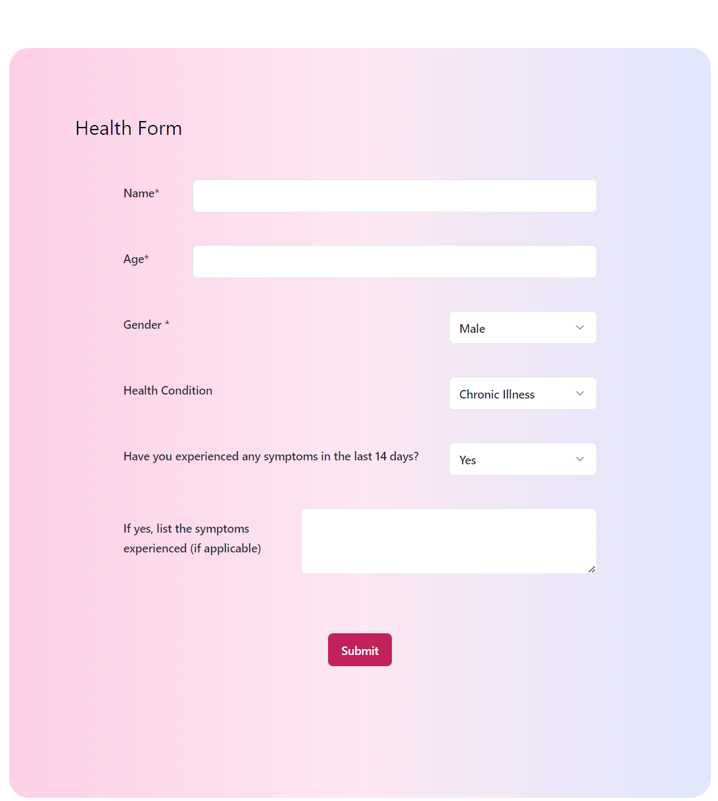
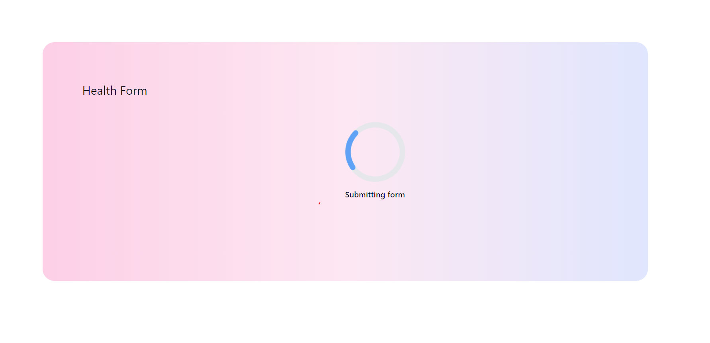
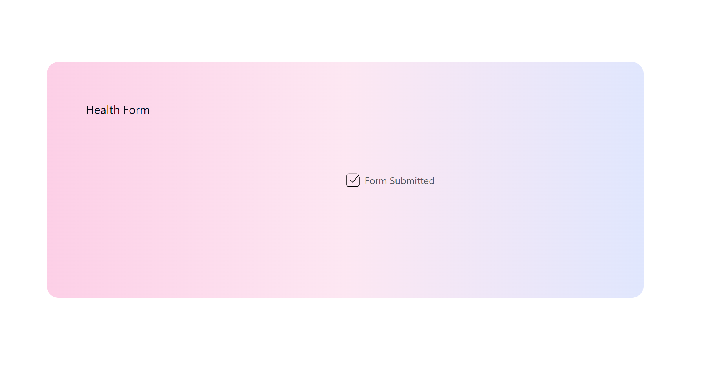

### Health Care Application

#### Project Overview

This project involves building a health care application featuring a form questionnaire with branching logic. The application is developed using Typescript for both frontend and backend. React is used for the frontend, while NodeJS serves as the backend. Data is stored and retrieved from a MySQL database. Unit tests are implemented to ensure the functionality and reliability of the application.



#### Features

Form Questionnaire with Branching Logic
Frontend: React with Typescript
Backend: NodeJS with Typescript
Database: MySQL
Unit Testing
Loading and success states





#### Installation

##### Prerequisites

Clone the repository and install frontend and backend dependencies:

```
cd frontend
npm install
```

```
cd backend
npm install
```

- Run the database in docker with `docker-compose up` at the root of the project

- Run migrations in the backend with `npx prisma db push`

- Start both frontend and backend services with: `npm run dev` in the frontend folder and `npm start` in the backend.

- The application should now be running on ports 8080 (backend) and 5137 (frontend).

Database Schema:

```


model Questionnaire {
  id                  Int             @id @default(autoincrement())
  name                String
  age                 Int
  gender              Gender
  healthCondition     HealthCondition
  symptomsExperienced Boolean?
  symptoms            String?
  createdAt           DateTime        @default(now())
}


enum Gender {
  Male
  Female
  Not_specified
}

enum HealthCondition {
  Healthy
  Minor_illness
  Chronic_illness
}

```

Technologies used:
React, Tailwind, TypeScript, MySQL, Prisma, Vite, Express, Jest, Docker,
